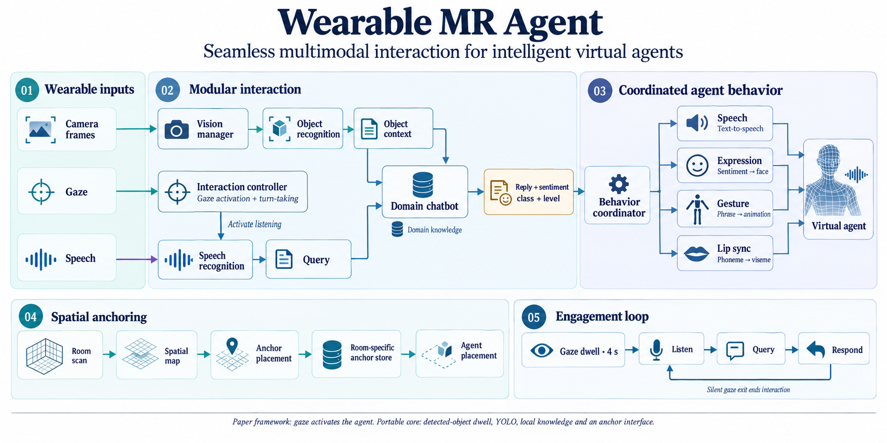
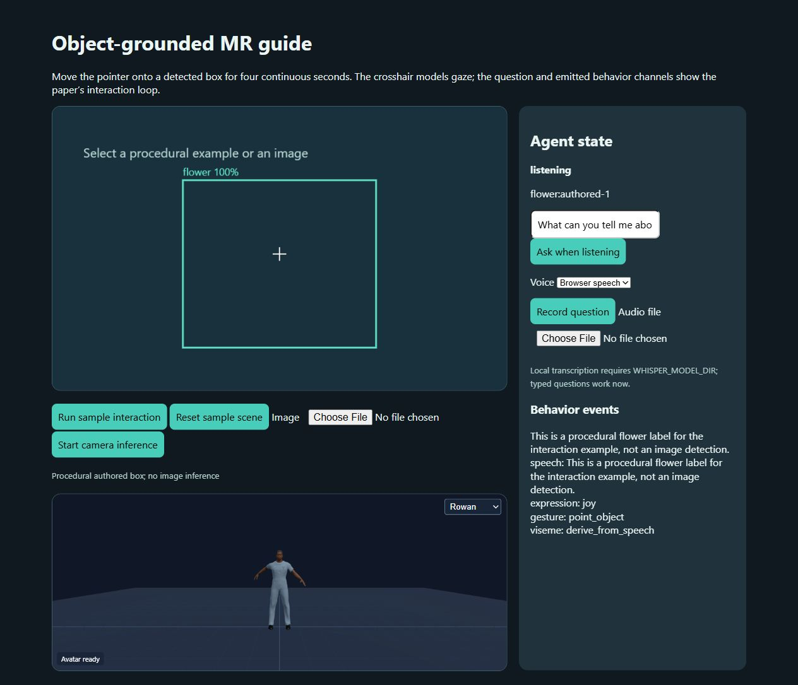

# Design of Seamless Multi-modal Interaction Framework for Intelligent Virtual Agents in Wearable Mixed Reality Environment

**Ghazanfar Ali, Hong-Quan Le, Junho Kim, Seung-Won Hwang, Jae-In Hwang**

**CASA · 2019** · Published

[Paper / publisher](https://doi.org/10.1145/3328756.3328758) · [Project page](https://ghazanfarali.com/research/wearable-mr-agent/) · [Video presentation](https://www.youtube.com/watch?v=zlmVpUgBdew) · [BibTeX](CITATION.bib) · [Requirements](REQUIREMENTS.md) · [Code & setup](#implementation-and-usage)

> A modular virtual guide combines speech, gaze, and spatial context in wearable MR.



*Graphical abstract diagram. Camera, gaze and speech inputs support object-grounded conversation and coordinated virtual-agent behavior.*

## Why this research

A wearable virtual guide must connect what a visitor says and looks at with the surrounding scene. Modular processing distributes these capabilities across the device and supporting services.

The framework integrates spatial mapping, speech recognition, gaze, object recognition, a domain-specific chatbot, and virtual-character animation. Computationally intensive components run on a cloud platform to support a wearable device with limited resources.

## Method at a glance

**Speech + gaze + scene** → **Modular agent / cloud** → **Embodied MR response**

| | Research system |
|---|---|
| Input | Speech, gaze, recognized objects, and spatial mapping |
| Method | Modular interaction framework with cloud-assisted processing |
| Output | An interactive virtual guide with verbal and animated responses |

## Evidence and scope

Paper reports responses within 2–4 seconds in its tests

**Attribution:** These findings describe the paper or manuscript, not results obtained with this repository's code.

**Study context:** Wearable mixed-reality application scenarios.

**Limitations:** The response measurements describe the tested hardware, network, and scenarios; cloud connectivity and spatial mapping are required by the design.

## Explore the implementation

Gaze-and-speech interaction with the character as the gaze target, proactive greeting, voice commands that trigger recognition of the gazed object, a pluggable chatbot with a four-class, three-level sentiment engine, an editable phrase/word animation table over public BEAT clips, thinking/filler latency hiding, and recognition-driven room anchors. The web demo replaces the HoloLens; persistent device anchors are not reproduced there.

This repository contains independently written research code. The institute's original source, datasets and trained models are not distributed. Public-data preparation, commands, assumptions and checks are documented below and in [REQUIREMENTS.md](REQUIREMENTS.md).

## Resources and citation

Read the paper through its [publisher record](https://doi.org/10.1145/3328756.3328758). PDFs are hosted by publishers or preprint archives rather than stored in this repository.

Watch the [existing YouTube presentation](https://www.youtube.com/watch?v=zlmVpUgBdew).

Please cite the research paper when using its ideas; [download the BibTeX citation](CITATION.bib). The implementation has its own documented scope.

<!-- demo-preview:start -->
## Demo preview



*Local demo with small starter examples; the capture illustrates the interface, not a reproduced paper benchmark.*

From the repository root, using the Python environment described below:

```sh
python -m pip install -e .
python -m pip install -r scripts/requirements-demo.txt
python scripts/start_demo.py
```

Open **http://127.0.0.1:8080/**. Click **Run sample interaction** to watch a scripted visit: dwell on the guide, proactive greeting, "what is this" on a flower, a follow-up, an anchored flower and general chat. The launcher prepares pinned Three.js modules and downloads one small official BEAT BVH/TextGrid sample on first run. It builds a nine-clip local bank under ignored `outputs/beat-library/`; the guide's phrase/word animation table (`demo/animation-table.json`) selects clips from it. Later runs reuse the cache. The first run needs internet access. Original recordings, large datasets, institute assets, and pretrained gesture weights are not distributed.

The 3D presentation uses shared Three.js avatar components and bundled fictional CC0 characters. The paper-specific algorithms and data adapters live in this repository.

Recorded co-speech motion comes from this repository's animation builder: the paper's expert-authored text-to-animation table, the earliest exact-rule method in the gesture lineage. Interaction, chatbot, sentiment, anchors and animation building are this application's core. The BEAT preparation and retrieval dependencies are vendored in this repository, so no sibling repository checkout is needed. See `scripts/prepare_beat_demo.py` to rebuild the ignored local bank.

<!-- demo-preview:end -->

## Implementation and usage

<!-- implementation-guide -->

This standalone repository reimplements the core loop from **“Design of Seamless Multi-modal Interaction Framework for Intelligent Virtual Agents in Wearable Mixed Reality Environment”** by Ghazanfar Ali, Hong-Quan Le, Junho Kim, Seung-Won Hwang, and Jae-In Hwang, CASA 2019, pp. 47–52. DOI: [10.1145/3328756.3328758](https://doi.org/10.1145/3328756.3328758).

The original implementation and its assets are held by the institute. This is a new implementation built from the paper. The original ran on HoloLens with Unity, Azure Custom Vision and a cloud chatbot; here the same modules run as a Python core behind a local web demo, and hosted services are pluggable clients with offline fallbacks. The repository does not include the original Unity project, flower images, knowledge base, characters, animations or trained weights, and it does not reproduce the paper's latency measurements.

### Paper components and where they live

| Paper (CASA 2019) | Code |
|---|---|
| Gaze on the character for 4 s starts the speech recogniser (2.1.1, Fig. 5) | `interaction.py` `InteractionStateMachine` (dwell configurable, default 4 s) |
| Silence after the dwell: the character opens with "Hello, do you need help?" | `proactive_greeting` event after `greeting_after_seconds` (default 3 s), once per conversation |
| Gaze out while the recogniser runs **and** the user is silent ends the conversation | `conversation_ended`; looking away while talking keeps it. `lookaway_grace_seconds` (default 1.5 s, `0` for the strict rule) gives time to look at an object before a command |
| Limited voice commands ("What is this", "Tell me about this") trigger recognition of the gazed object | `commands.py` `VoiceCommands` (word-boundary match, configurable list); commands also open a conversation from idle |
| Vision manager: any recogniser reachable as an endpoint (2.1.2) | `recognition.py`: `DetectorRecognizer` (YOLO, box under the gaze point), `HttpRecognizer` (`--vision-endpoint`), `SimulatedRecognizer` (web-demo rooms) |
| Chatbot `(Query, Object) → (Reply, Sentiment class, Sentiment level)`; follow-ups without re-gazing; general conversation in any order (2.1.3, Fig. 6) | `chatbot.py` `Chatbot` with conversation history; clients `OpenAICompatibleChatbot` (`--chat-endpoint`), `CommandChatbot` (`--chat-command`), offline `DomainKnowledge` (`knowledge.py`) |
| Sentiment engine: Joy / Angry / Sad / Fear × High / Medium / Low (Fig. 7) | `sentiment.py`: `HttpSentimentClassifier` (`--sentiment-endpoint`), `OpenAICompatibleSentimentClassifier` (`--sentiment-llm-endpoint`), offline `LexiconSentimentClassifier`; mapped to the renderer as `setExpression('happiness'|'anger'|'sadness'|'fear', 1–3)` for the whole utterance |
| Expert-authored phrase/word → animation table and animation builder (2.2, Fig. 8) | `animation.py` `AnimationTable` + `AnimationBuilder`; editable `demo/animation-table.json`. Phrases longest first, then words in unclaimed text, ordered by position and timed against the reply |
| Speech, body animation and face applied in parallel; lip sync from text phonemes (Fig. 9–10) | Web demo: speech progress drives the timed animation list; the shared renderer derives visemes from the reply text |
| Thinking animation and "let me see…" while recognition and the chatbot are pending (Section 4) | `AgentRuntime.submit` returns at once with a `THINKING` cue (animation + filler); the job runs in the background. The filler plays immediately when recognition runs, otherwise after `filler_delay_seconds` |
| Anchor placement with recognised objects; recognition selects room-specific anchors; anchored objects skip recognition (2.3, Fig. 11, Table 1 Query A vs C) | `anchors.py` `AnchorManager` (`place`, `observe_recognition`, `resolve`); a label shared by identical rooms waits for more evidence |
| Several characters with their own voices; two rooms (5 + 4 flowers) | `demo/scenario.json`: Mira in room 1, Rowan in room 2, per-character voice, pitch and rate |

### Quick start

Python 3.10 or newer. From this folder:

```sh
python -m pip install -e ".[dev]"
python -m pip install -r scripts/requirements-demo.txt
python scripts/start_demo.py          # prepares Three.js and the small BEAT bank, then serves http://127.0.0.1:8080/
pytest -q
python scripts/verify.py
```

`python -m wearable_mr.demo` serves the same page on port 8761 without preparing anything. Without the BEAT bank the animation table falls back to its procedural gestures.

### Using the web demo

- **Gaze.** *Mouse ray* casts a ray from the pointer; *Screen centre* casts it through the crosshair, and dragging or the arrow keys turn the head. The guide is the gaze target: rest the ray on the guide for the dwell time and the state changes to *listening*. With the mouse ray, the gaze stays where it was while you type or click outside the scene; point at empty space in the scene to look away.
- **Speech.** *Microphone* uses the browser's speech recognition (Chrome/Edge) continuously, and its voice activity tells the server whether you are speaking. The text field is the typed fallback: typing counts as speaking. *Record (local Whisper)* transcribes into the field when `WHISPER_MODEL_DIR` is set.
- **Voice commands.** Look at a flower and say or type "what is this" or "tell me about this". The gaze target at the start of the utterance is sent with it. Follow-ups such as "how do I care for it?" use the remembered object. General questions ("who are you?") work at any time.
- **Rooms and anchors.** The room selector simulates walking between two rooms. The first recognised flower in a room loads that room's anchors (*Query A*); later commands on anchored flowers skip recognition. *Reset visit* unloads them.
- **Webcam.** Choose *Webcam frame → YOLO* and start the webcam (or pick an image). A voice command then sends the current frame to the server, which recognises the object under the frame centre. Start the server with `--weights yolo11n.pt` (or your trained checkpoint, after `pip install -e ".[yolo]"`); without weights the guide says that no detector is configured and the simulated rooms keep working.
- **Voices.** Each guide has a preferred browser voice, pitch and rate in `demo/scenario.json`. The optional local Kokoro backend uses one voice for all characters.

### Plugging in services

The demo, `chat` and `camera` commands accept the same options:

```sh
# OpenAI-compatible chatbot (hosted, vLLM, llama.cpp server, Ollama /v1, ...); the key is read from --api-key-env
python -m wearable_mr.demo --chat-endpoint http://127.0.0.1:8000/v1 --chat-model my-model --api-key-env OPENAI_API_KEY
# Local program: JSON {query, object, history} on stdin, reply text or {"reply": ...} on stdout
python -m wearable_mr.demo --chat-command "python my_bot.py"
# Sentiment service: POST {text} -> {class, level} or {label, score}; or an OpenAI-compatible model
python -m wearable_mr.demo --sentiment-endpoint http://127.0.0.1:9000/sentiment
python -m wearable_mr.demo --sentiment-llm-endpoint http://127.0.0.1:8000/v1 --sentiment-model my-model
# Remote vision API for camera frames: POST {image: base64 JPEG} -> {label, confidence}
python -m wearable_mr.demo --vision-endpoint http://127.0.0.1:9100/recognize
```

The language-model chatbot is grounded with the curated facts for the recognised object. When a configured client fails, the offline knowledge chatbot or lexicon classifier answers and the reply records the error. Nothing is downloaded automatically.

### Command line

```sh
wearable-mr-agent chat --say "@rose what is this"           # '@label' simulates looking at an object
wearable-mr-agent chat                                       # interactive text conversation
wearable-mr-agent animate "Hello, do you need help? I think you can look at this rose."
wearable-mr-agent sentiment "Careful, the thorns are sharp."
wearable-mr-agent image frame.jpg --weights yolo11n.pt
wearable-mr-agent camera --weights yolo11n.pt               # centre crosshair = gaze; press A and type an utterance
```

### Authoring the domain

- **Knowledge** (`demo/knowledge.json`, `--knowledge`). Keys are recogniser labels. Each object has an `overview` and `topics`; a topic is text or `{"text", "keywords"}`. Matching uses whole words and plural/possessive forms, never substrings. An optional `general` list adds `{intent, patterns, reply}` entries to the built-in greetings, identity, help, yes/no, thanks and farewell intents.
- **Animation table** (`demo/animation-table.json`, `--animation-table`). `phrases` (two or more words) and `words` map to `{"clip": <BEAT window id>, "procedural": <open|point|wave|think|beat|nod>}`. A window id such as `1_wayne_0_1_1:780-855` (take and 30 fps frame range, "okay i'll go for a walk or hike") stays stable when the bank is rebuilt; a bank clip id such as `beat_04` also works and resolves by ordinal (the fourth clip). When the prepared bank does not hold the window, the procedural gesture plays. `min_gap_words` spaces single-word triggers. The bundled table has about 50 entries chosen from the BEAT window transcripts.
- **Scenario** (`demo/scenario.json`, `--scenario`). Agent timings, voice commands, greeting and fillers; characters and voices; rooms with prop ids, labels and positions. Each prop is also a pre-placed anchor. `--anchors anchors.json` persists anchors to a file.
- **Detector.** For your own objects, prepare an Ultralytics dataset (`images/train`, `images/val`, YOLO labels, `dataset.yaml`), run `yolo detect train model=yolo11n.yaml data=dataset.yaml epochs=100 imgsz=640`, and pass the resulting `best.pt` with `--weights`. Keep knowledge keys equal to the detector's class names.

### Checks

`pytest -q` covers the state-machine timing (dwell, greeting, look-away while speaking, strict rule, timeouts), voice commands, follow-ups and general chat, the chatbot and sentiment clients against stub servers and a local command, sentiment-to-expression mapping, builder ordering (including the old "this" before "I" bug), longest-phrase-first matching, clip resolution, anchor-based recognition skipping, the asynchronous thinking state, and the demo HTTP routes. `python scripts/verify.py` drives a full offline visit and writes the transcript to `outputs/verify/response.json`; `--with-yolo` also runs the YOLO adapter on randomly initialised weights, without downloads.

### Not reproduced in the web demo

- **Persistent spatial anchors.** World-locked anchors need a device runtime (HoloLens, or WebXR Anchors in Android/Quest browsers). The desktop demo simulates rooms and pre-placed anchors; `AnchorProvider` is the interface for a device adapter.
- **WebXR head gaze.** The demo uses the mouse or screen-centre ray; it does not open an immersive WebXR session.
- **Mixed-reality rendering of real objects.** Flowers are procedural props, and their labels come from the room description (`SimulatedRecognizer`). Real recognition runs on webcam or image frames with your YOLO weights.
- **The paper's chatbot, sentiment and vision services, flower dataset and timings.** These are replaced by pluggable clients and offline fallbacks; the measured 2–8 s response times are not reproduced.

### Optional local speech

Browser speech is selected by default. To enable the **Local Kokoro** selector and audio transcription, install `python -m pip install -e ".[speech]"`. Prepare model files yourself outside this repository: set `KOKORO_MODEL_DIR` to a folder containing `config.json`, `kokoro-v1_0.pth`, and `voices/af_heart.pt` from [Kokoro-82M](https://huggingface.co/hexgrad/Kokoro-82M). Follow the [Kokoro phonemizer setup](https://github.com/hexgrad/kokoro), including espeak-ng where needed. Set `WHISPER_MODEL_DIR` to a locally prepared faster-whisper small model directory containing `model.bin`. For example, in PowerShell, `$env:KOKORO_MODEL_DIR='C:\path\to\kokoro'` and `$env:WHISPER_MODEL_DIR='C:\path\to\whisper-small'` before launching the demo. The server checks those paths and returns actionable errors when absent; it does not download weights.

<!-- avatar-recorded-motion:start -->
## Bundled characters and recorded public motion

The browser demos include Rowan and Mira, two new fictional GLB characters built with MPFB and MakeHuman community assets under CC0 1.0. See [avatar licensing and provenance](static/avatars/LICENSE.md). Use the character selector in the stage. The shared renderer supports body bones, ARKit facial channels, and approximate speaking motion.

Recorded motion is adapted to the characters' proportions. Palm landmarks set hand orientation; finger curl uses bounded hinge bends and preserves the character's finger spacing. Thumb-base opposition stays in the authored pose, with conservative recorded curl at the remaining joints. Distal bends are estimated from the preceding joint when fingertip landmarks are absent. Use the companion's hand close-up views to inspect the result.

The [avatar motion companion](static/recorded-motion.html) opens at `/static/recorded-motion.html` while the demo server is running. A small authored motion and face sample loads automatically; click **Play** without uploading files. It also plays locally selected BEAT motion, face, and WAV files on the bundled characters. These are presentation and data-inspection tools, separate from the paper implementation. No BEAT recording, dataset archive, or trained model is bundled. For recorded public motion, install the one preparation dependency and fetch a small official sample into ignored `outputs/beat-demo/`:

```sh
python -m pip install numpy
python scripts/beat_demo/fetch_modalities.py --speaker 1 --sequence 1_wayne_0_1_1 --include-bvh --max-bytes 25000000 --output-dir outputs/beat-demo/source
python scripts/beat_demo/prepare_bvh.py --bvh outputs/beat-demo/source/1_wayne_0_1_1.bvh --output outputs/beat-demo/sample/1_wayne_0_1_1-raw-motion.json --frames 120
python scripts/beat_demo/prepare_modalities.py --sequence 1_wayne_0_1_1 --source outputs/beat-demo/source --output outputs/beat-demo/sample --frames 120
```

Open the companion and select `outputs/beat-demo/sample/1_wayne_0_1_1-raw-motion.json`, `1_wayne_0_1_1-face.json`, and `1_wayne_0_1_1.wav`. The downloader caps each original file at 25 MB; the prepared clip contains up to 120 frames. The viewer uses local files and does not upload them. For other BEAT takes, substitute a matching official speaker and sequence ID.

If you already have OmniMo's processed 52-joint Unity humanoid data, use that normalized motion instead:

```sh
python scripts/beat_demo/prepare.py --dataset /path/to/processed/beat --speaker 1 --take 1_wayne_0_1_1 --output outputs/beat-demo/sample/1_wayne_0_1_1-motion.json --max-frames 120
```

Select the resulting `*-motion.json` in the companion. Its metadata carries the humanoid joint mapping and source-to-avatar coordinate conversion. The viewer fits source FK directions from the avatar's bind pose, following the spine explicitly at branching joints. This avoids applying incompatible source bone twist to the MPFB skin; it does not reproduce exact performer twist. The adapter supports Unity proximal/intermediate/distal finger names. Raw BVH remains a public-data alternative; do not mix the two skeleton conventions.
<!-- avatar-recorded-motion:end -->

## License

Code is MIT licensed; see [LICENSE](LICENSE). The bundled fictional characters and authored starter fixtures keep their CC0 1.0 dedication, and datasets or models you download keep their own licences.
